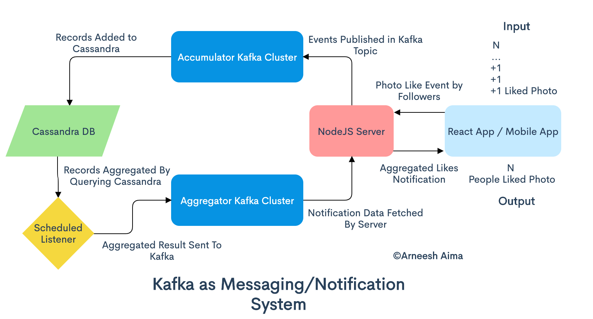
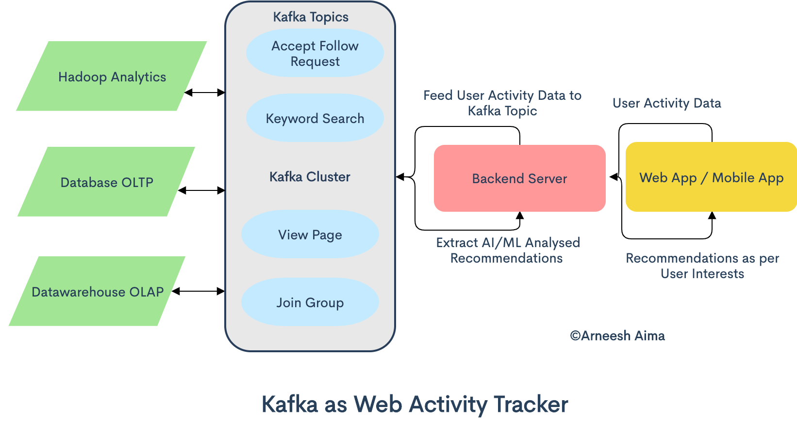

# LimeChain Instagram like Service - Design

For most of the examples I will be working with AWS, as I have most experience with it.

## DNS and Proxy

For DNS and Proxy we could use Cloudflare, pretty much a standard these days. Most likely CloudFront will be used is some cases.
In frontend deployment and access to the S3 buckets from an URL under the main domain.

## Frontend

### React Web Client App

For the web app I recommend React as it is fast, modular, easy to learn, have a great community and it is well supported.

Language to be used - TypeScript

### React Native Mobile Client App

As the web app is written in React. React Native is the logical choice for the mobile app. You can reuse lots of code through
NPM or GitHub packages. Some use Monorepos for both apps, but I do not recommend this here, having in the mind the task.
Codebase will become too big and clunky to maintain.
This approach removes the need of additional specific (iOS or Android) developers and saves time to develop compared to the native iOS or Android development.
Little drop of performance is fine for this kind of app.

Language to be used - TypeScript

### Deployment

The mobile app obviously will be placed in App Store and Play Store so people can install it on their mobile devices.

The web app can be deployed in AWS in a S3 bucket with the following configurations. Of course any other hosting will work.
- Simple S3 deployment with public bucket and direct access to the bucket, the worst deployment option.
- CloudFront -> S3 so we use the caching provided and isolate the bucket from access outside CloudFront.
- Cloudflare -> CloudFront -> S3, even more of the above, as Cloudflare has some great features.
- Cloudflare -> S3 is also an option but it had limitations and abandoned that in the past. I haven't checked lately but I do not think the limitations are lifted.
- All the deployments above incorporate frontend rendering. If we want backend rendering, so we have better SEO and smoother experience for users - S3 with Lambda.
This article explains it in details - https://aws.amazon.com/blogs/compute/building-server-side-rendering-for-react-in-aws-lambda/. Never done that as it is more expensive option. The configuration is pretty straight forward.
- A tool for CI/CD like CircleCI to make the above process easier.

## Backend

### Load Balancers

A path style load balancer is a good approach here (ALB in AWS). So we have a single url to call. It is not impossible to place separate load balancers for every service but makes the deployment more complex. Another load balancer can be created for the external API calls. This is to make separation of concerns and security.

### User Service

It will contain CRUD endpoints for user profiles. Despite the fact it will be at the core of the system and it will be heavily loaded.
It can be written with TypeScript and Node.js. It will be sufficient enough and it will share technology stack with the Ffrontend.

SQL style database is sufficient here. A cluster capabilities will be required, like the MariaDB Gallera Cluster.
The exact choice depends mainly on the budget and further detailization of the requirements.

### Authentication Service

The service will implement JWT tokens. OAuth 2.0 and most likely simple username/password flow.
There will be various types of tokens
- Short-term tokens for initial work with the service, if an external API will be implemented.
- Long-term tokens, if an external API will be implemented.
- Short-term tokens for user authentication, they will be associated with the long term tokens that the system will keep for every user.
They will be the main tokens used for user authentication. Its purpose will be to keep the long term tokens save and not exposed to the frontend.
As soon as the long term tokens are invalidated, all short term tokens become invalid.
- Long-term tokens for every user. They will be mainly for internal service operations and for creation and invalidation of the short-term tokens.

The system can be implemented with TypeScript and Node.js too, probably the best choice as it will share stack with the rest. Another good option is PHP8, it is stable, robust and proven over time. It has all the tool for such system to be implemented easily. Go Lang could also be used but it is a bit of a overkill for such service.

SQL or NoSQL database will work here. The final choice will require further tests, poc and detailization of the requirements.
Tokens will be stored for the purpose of invalidation when necessary.

### Upload Service

This will be the service that will upload user content, images and videos (if implemented one day). The system won't work with a database,\
but with a storage system. Like S3 for example.
It will implement `tus - resumable file uploads protocol` (https://tus.io/). It will be used for chunk upload of big files. Also to mitigate problems with slow
internet connection (user from India or Iran for example). It has good libraries for React so it will easily implemented on the frontend.
For the service implementation Node.js with TypeScript is not a good option. As the official implementation of the tus lib for Node.js is not very well maintained. It lacks functionality and support. Go and PHP on the other hand have much better libraries.

### Content Service

This will be the most loaded service as it will contain the CRUD endpoints for all the media (images and probably videos in the future).
It will call the `Media Processing` system to manipulate the already uploaded media to S3.
It will store all the content (urls no binary files of course, both databases are not good for binaries) inside NoSQL database due to the nature of the data stored. Very good candidates are MongoDB and Cassandra.
Probably my choice will be the later one - Cassandra, as it is build to work in distributed environment, with scalability and high availability in mind without compromising performance. Processing could be done in sync or async way. For example creating a single image could be in a sync way as the processing will be fast. Multi-photo uploads or video uploads will be in async fashion due to the longer processing. So the frontend will be notified in push notification manner through WebSocket connection, Push Web API or long polling with AJAX. The data will be cached in two layers of cache - first level Redis, second level Aerospike. So we reduce the readings directly from the main database. Having in mind the load and the request it will be handling, performance will be crucial. So a very good candidate is Go Lang.

### Media Processing

Processes media, images and probably videos - resize, crop, rotate, transcode etc..
It could be written in TypeScript with Node.js. As it has very good integration with ffmpeg, fast and quality libraries like Sharp for image processing.
External services could also be considered.

### Preloader/Caching Service

This service will be doing the preloading and caching of media data in the two levels of cache for the `Content Service`.
The best will be to be integrated with the same technology as the `Content Service` so a code could be shared.
The caching itself can be done in two ways. With direct communications with the `Content Service` where caching endpoints will be created.
The other approach is sharing model definitions and functionalities as packages.
Why two levels of cache? Redis is very fast but it lacks functionalities and it is also expensive.
So only the critical and most recent data will be there. Aerospike on the other hand is slower than Redis but faster than Cassandra or MongoDB\
as it is optimized for SSD operations. So it could store daily data for example.
In the context of the task the public feed could be cached in Redis. Feeds of users active in the last day could be cached in the Aerospike and moved
towards Redis when needed.

### Search Engines

Most likely a search engine will be needed. For such a service we should use some dedicated system.
One option is in house search engine written around the `Elastic Stack`. This of course won't be a simple task.
Another option is to use external service like `Algolia`. The benefits are that we won't need to write that in house system.
But in the long run the first solution may be the better option.

### Potential Services

#### Notification Service

Most likely the time will come to implement notifications to the users. I have researched recently for a solution for my current work.
I came to one based on Kafka that is used by Facebook and the big companies so I propose it here.

#### Web Activity Tracker

Sooner or later the time comes to record use actions. So here is another solution that is also based on Kafka.
This one is in the pipeline to be implemented in my current work.

### Deployment

For most of the services probably the best option, in the context of AWS is ECS Fargate. Rock solid, easy to configure, scale and maintain. Yes it is more expensive but it is worth the price. Another option is ECS EC2 tasks. There you need an instance and a little of admin work over time. Also running in potential problems with the ECS Container Agent. Scaling is not so easy as with Fargate. Probably Lambda will be a good solution in some cases. For the database engines AWS has dedicated services.
All other bare metal deployments are possible.
A tooling like CirceCI is a must too. Kubernets or other orchestration will be needed, multicluster setup will be required at some point.
Honestly I do not have practical experience with orchestration. But looking into it as I want to integrate it my current work.

## Notes

As you have seen in all the systems I prefer TypeScript over JavaScript. Why is that?
The answer is very simple. TypeScript allows for better static analysis.
And most importantly it has static typing capabilities. Lots of the problems can be detected at compile time.
And in the end it is just superset of JavaScript so you can easily integrate JavaScript stuff in it.

I have added caching only for the `Content Service` to simplify things. Caches could be used in the other services as needed.
